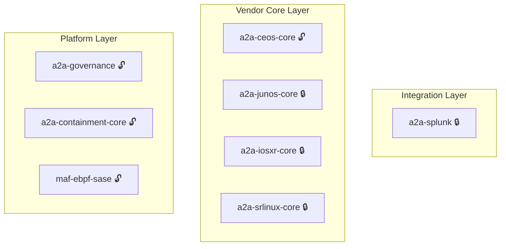

# Hi there 👋, I'm hidemi-k

### OSS R&D Engineer | Autonomous Networking & Multi-Agent Systems
Building autonomous networking systems. Focused on eBPF, Containerlab PoCs, NETCONF automation, and A2A (Agent2Agent) workflows.

---

## 🌐 Autonomous Multi-Vendor Network Automation & A2A Ecosystem

Welcome to the open architecture of the **A2A Protocol**—a multi-agent framework designed for standardized network operations, security, and governance across multi-vendor environments.

## 🧩 A2A Architecture Overview
The A2A ecosystem is structured into three layers:
- Platform Layer
- Vendor Core Layer
- Integration Layer

### 🏛️ Detailed Architecture Map

🔓 Public &nbsp; 🔒 Private — new vendor cores and integrations added continuously.

