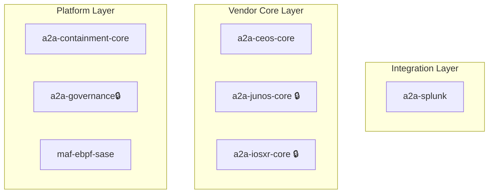

# Hi there 👋, I'm hidemi-k

**Independent OSS R&D Engineer** | Autonomous Networking & Multi-Agent Systems  
*Personal research project, not affiliated with my employer.*

I explore autonomous networking systems as an independent R&D effort.  
My current focus areas include eBPF, Containerlab PoCs, NETCONF automation, and A2A (Agent2Agent) workflow design.

---

## 🌐 Autonomous Multi-Vendor Network Automation & A2A Ecosystem (R&D)

This is my personal exploration of the A2A Protocol concept—an experimental multi-agent framework I'm prototyping for standardizing network operations, security, and governance across multi-vendor environments.

## 🧩 A2A Architecture Overview

I'm structuring this experimental framework into three layers:

- Platform Layer
- Vendor Core Layer
- Integration Layer

### 🏛️ Detailed Architecture Map

🔒 private

